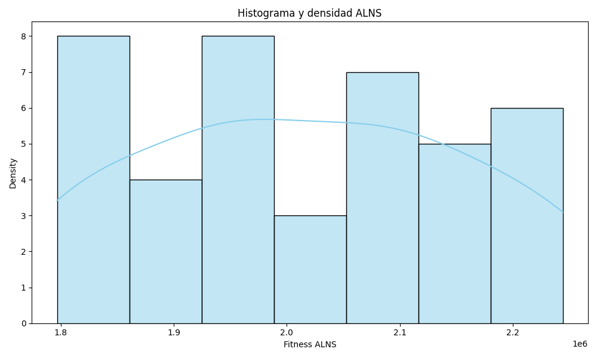
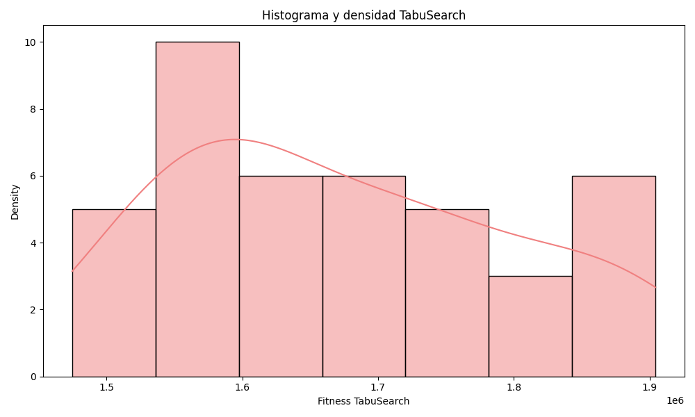

# MoraPack Algorithm Comparison Experiment Report

Date: 2025-09-25 16:25:53

## Experiment Configuration

- Number of simulations: 41

## Summary Statistics

| Metric   |             ALNS |       TabuSearch |
|:---------|-----------------:|-----------------:|
| Mean     |      2.01632e+06 |      1.67316e+06 |
| Median   |      2.01144e+06 |      1.64256e+06 |
| Std Dev  | 139704           | 124288           |
| Min      |      1.79667e+06 |      1.47472e+06 |
| Max      |      2.24424e+06 |      1.90436e+06 |

## Normality Tests

### ALNS

- Shapiro-Wilk test statistic: 0.942124
- p-value: 3.719381e-02
- Conclusion: Not normally distributed

### TabuSearch

- Shapiro-Wilk test statistic: 0.948904
- p-value: 6.405048e-02
- Conclusion: Normally distributed

## Statistical Comparison

### Wilcoxon Signed-Rank Test (Two-tailed)

H0: The medians of ALNS and TabuSearch are equal.
H1: The medians of ALNS and TabuSearch are different.

- Test statistic: 8.0
- p-value: 2.273737e-11
- Conclusion: Reject H0

### Wilcoxon Signed-Rank Test (One-tailed)

H0: The median of ALNS is less than or equal to the median of TabuSearch.
H1: The median of ALNS is greater than the median of TabuSearch.

- p-value: 1.136868e-11
- Conclusion: Reject H0

## Conclusion

There is a statistically significant difference between the performance of ALNS and TabuSearch algorithms.

The ALNS algorithm consistently outperforms the TabuSearch algorithm in terms of objective function value.

## Visualizations

### QQ Plots

### Histograms

### Comparison

