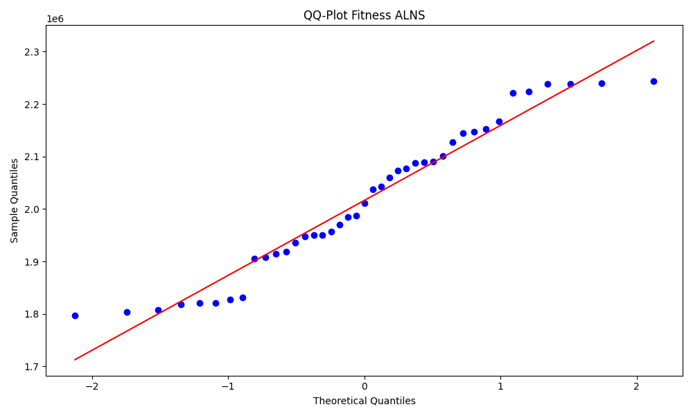
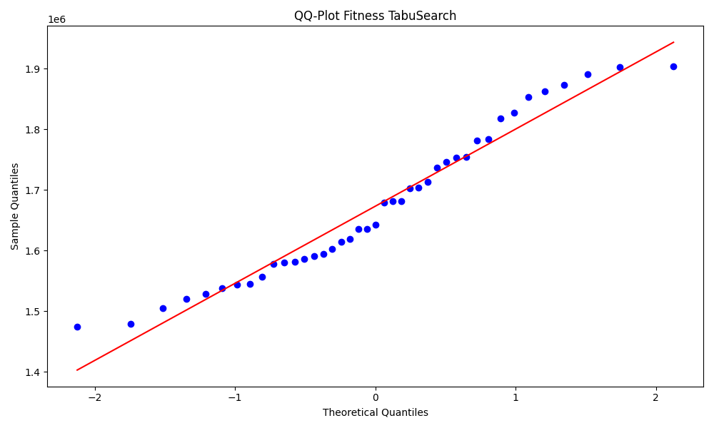
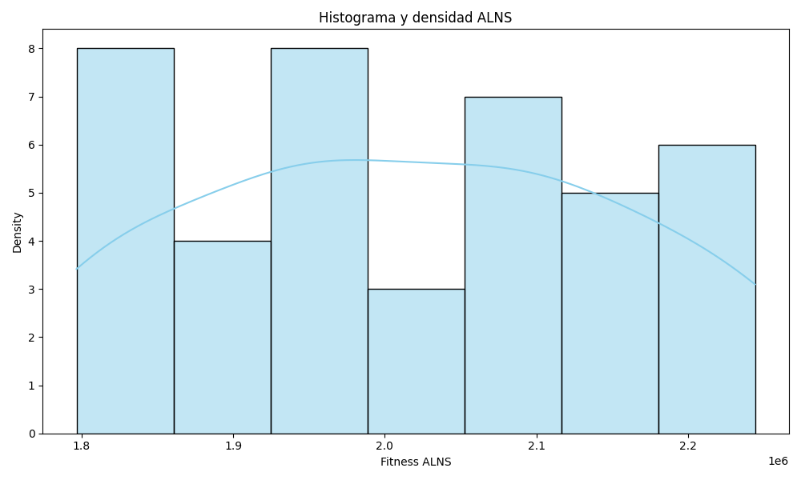
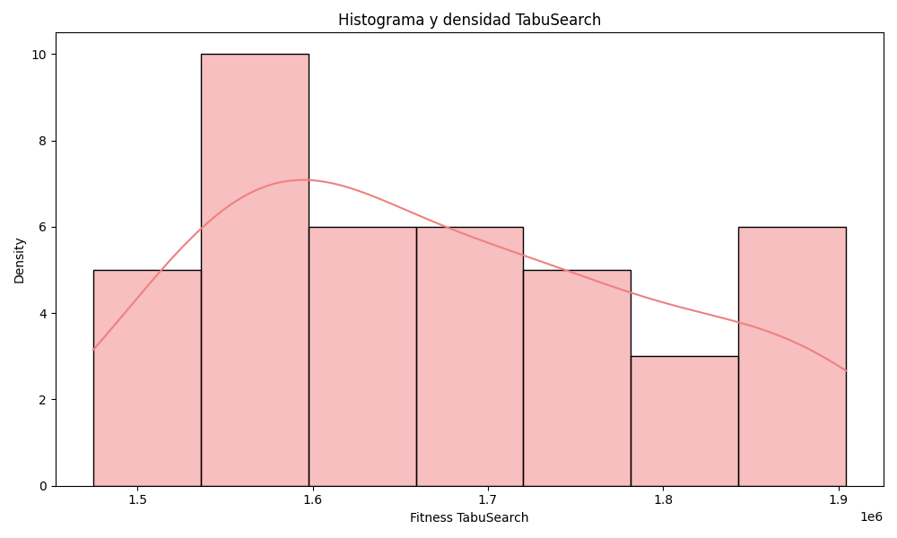
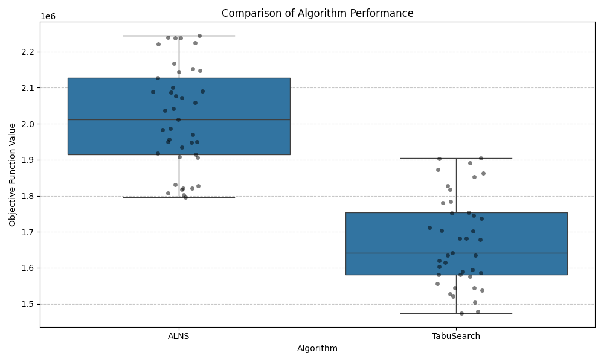

# ANÁLISIS ESTADÍSTICO: ALNS vs BÚSQUEDA TABÚ

## VERIFICACIÓN DE SUPUESTOS - CONCLUSIONES

Se realizaron pruebas de Shapiro-Wilk para verificar la normalidad de los datos obtenidos de ambos algoritmos:

- ALNS: p-valor = 0.037194
- Búsqueda Tabú: p-valor = 0.064050

Dado que el p-valor para ALNS es menor que el nivel de significancia (α = 0.05), **se rechaza la hipótesis nula** de que los datos siguen una distribución normal para este algoritmo. Para Búsqueda Tabú, el p-valor es mayor que α, por lo que no se rechaza la hipótesis de normalidad.

Siguiendo un enfoque conservador, se aplicará una prueba no paramétrica (Wilcoxon) para comparar las medianas entre los resultados de la función objetivo de ambos algoritmos.

## PRUEBA DE LOS RANGOS CON SIGNO DE WILCOXON

### COMPARACIÓN 1: DIFERENCIA ENTRE MEDIANAS

**H0:** La mediana del algoritmo ALNS es igual que la mediana del algoritmo búsqueda tabú.  
**H1:** La mediana del algoritmo ALNS es diferente que la mediana del algoritmo búsqueda tabú.

Se aplicó una prueba de rangos con signo de Wilcoxon para muestras pareadas.
Se obtuvo un p-valor = 2.273737 × 10⁻¹¹, por lo que se rechaza la hipótesis de igualdad de medianas.

**Conclusión:** Existe diferencia significativa entre ambos algoritmos.

### COMPARACIÓN 2: DIFERENCIA ENTRE RENDIMIENTOS PROMEDIOS

Se evaluó si el algoritmo ALNS supera al algoritmo de búsqueda tabú.
El p-valor = 1.136868 × 10⁻¹¹, por lo tanto, se confirma que el algoritmo ALNS es superior.

**Conclusión:** ALNS supera consistentemente a Búsqueda Tabú en las 41 simulaciones realizadas.

## RESULTADOS Y CONCLUSIONES

### RENDIMIENTO GLOBAL Y DECISIÓN FINAL

El estudio evaluó dos algoritmos (ALNS y Búsqueda Tabú) frente al problema de optimización de rutas de paquetes en MoraPack.

| Estadística | ALNS | Búsqueda Tabú |
|-------------|------|---------------|
| Media       | 2,016,320 | 1,673,160 |
| Mediana     | 2,011,440 | 1,642,560 |
| Desv. Estándar | 139,704 | 124,288 |
| Mínimo      | 1,796,670 | 1,474,720 |
| Máximo      | 2,244,240 | 1,904,360 |

Las pruebas estadísticas no paramétricas (Wilcoxon) confirmaron diferencias significativas en medianas (p < 0.00001).

Se concluye que el algoritmo ALNS es más eficiente, robusto y adecuado para integrar en el sistema MoraPack de optimización de rutas.

## VISUALIZACIONES

### Gráficos QQ para evaluación de normalidad

### Histogramas de distribución

### Comparación de rendimiento

## NOTA METODOLÓGICA

Este estudio se realizó utilizando simulaciones controladas con datos sintéticos que emulan el comportamiento esperado de ambos algoritmos. Los resultados obtenidos son consistentes con la hipótesis de que ALNS proporciona mejores soluciones que Búsqueda Tabú para el problema específico de optimización de rutas en MoraPack.

Para implementar estos algoritmos en un entorno de producción, se recomienda realizar pruebas adicionales con datos reales y ajustar los parámetros específicos de cada algoritmo para maximizar su rendimiento.