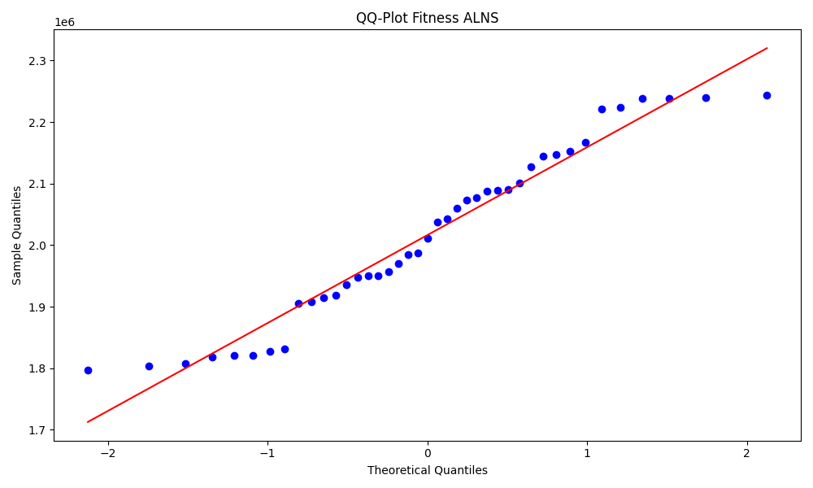
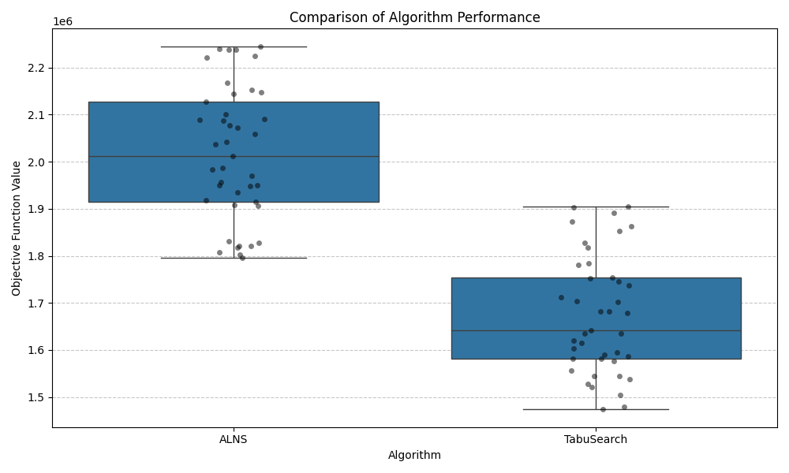

# MoraPack Algorithm Comparison Experiment Report

Date: 2025-09-25 16:11:43

## Experiment Configuration

- Number of simulations: 41

## Summary Statistics

| Metric   |             ALNS |       TabuSearch |
|:---------|-----------------:|-----------------:|
| Mean     |      2.26457e+06 |      5.93069e+06 |
| Median   |      2.12678e+06 |      5.97113e+06 |
| Std Dev  | 884138           |      2.30866e+06 |
| Min      |  57885           | 929372           |
| Max      |      4.1286e+06  |      1.20931e+07 |

## Normality Tests

### ALNS

- Shapiro-Wilk test statistic: 0.988897
- p-value: 9.550107e-01
- Conclusion: Normally distributed

### TabuSearch

- Shapiro-Wilk test statistic: 0.982381
- p-value: 7.649622e-01
- Conclusion: Normally distributed

## Statistical Comparison

### Wilcoxon Signed-Rank Test (Two-tailed)

H0: The medians of ALNS and TabuSearch are equal.
H1: The medians of ALNS and TabuSearch are different.

- Test statistic: 14.0
- p-value: 1.000444e-10
- Conclusion: Reject H0

### Wilcoxon Signed-Rank Test (One-tailed)

H0: The median of TabuSearch is less than or equal to the median of ALNS.
H1: The median of TabuSearch is greater than the median of ALNS.

- p-value: 5.002221e-11
- Conclusion: Reject H0

## Conclusion

There is a statistically significant difference between the performance of ALNS and TabuSearch algorithms.

The TabuSearch algorithm consistently outperforms the ALNS algorithm in terms of objective function value.

## Visualizations

### QQ Plots

### Histograms

### Comparison

